## 项目简介

<p align="center">
  <a href="https://golang.google.cn/">
    
  </a>
  <a href="https://gin-gonic.com/">
    
  </a>
  <a href="https://gorm.io/">
    
  </a>
  <a href="https://redis.io/">
    
  </a>
  <a href="https://vuejs.org/">
    
  </a>
  <a href="https://antdv.com/docs/vue/introduce-cn/">
    
  </a>
</p>

> LuBan 鲁班运维平台3.0， 本项目使用Go1.15.x、 Gin、Gorm开发， 前端使用的是Vue3+Ant Design2.2.x框架。


#### 项目源码
|     |   后端源码  |   前端源码  |
|---  |--- | --- |
|  github   |  https://github.com/dnsjia/luban   |  https://github.com/dnsjia/luban/luban_fe   |


## 使用说明
1. 安装编译
```shell script
# 拉取代码
git clone https://github.com/dnsjia/luban.git

# 打包
cd luban
go build main.go -o ./luban
or
GOOS=windows GOARCH=amd64 go build main.go ./luban

# 启动
./luban

# 启动前端
cd luban/luban_fe
npm install
npm run dev
```

2. 启动服务前先创建etc/config.yaml
```shell script
# 数据库配置
mysql:
  path: '192.168.1.96:3306'
  db-name: 'luban'
  username: 'root'
  password: '123456'
```

3. 初始化数据库
```go
windows执行以下脚本, 初始化数据库

init_db.bat
```
4. 初始账号: luban@qq.com 密码: test1234

#### 目前已经实现的功能
* 用户登录
  * LDAP/Email
  * 钉钉扫码登录(开源版暂未开放)
* 权限管理
* 用户注册登录
  * [如何配置LDAP](.)
  * [配置钉钉扫码](.)
- K8S多集群管理
  * [集群管理](.)
  * [节点管理](.)
  * [工作负载](.)
  * [存储管理](.)
  * [网络管理](.)
  * [配置管理](.)

- 资产管理
  * [远程连接](.)


## Demo地址

> [http://115.231.236.19](http://115.231.236.19:8822)
> 
> 账号: luban@qq.com  密码: test1234

## 首页


## 仪表盘
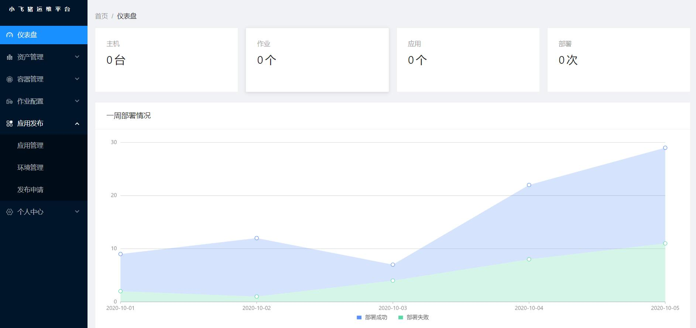

## 资产管理
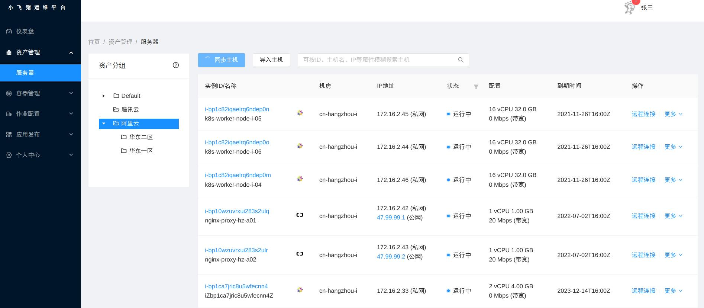

## 文件管理
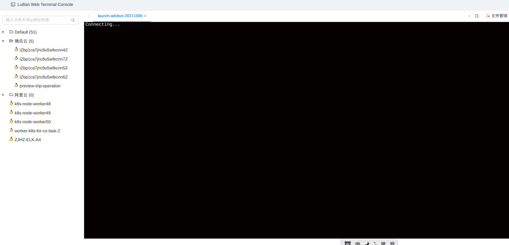

## 远程连接
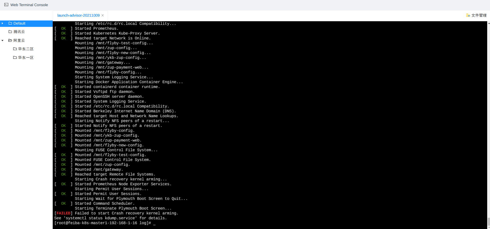

## 集群管理
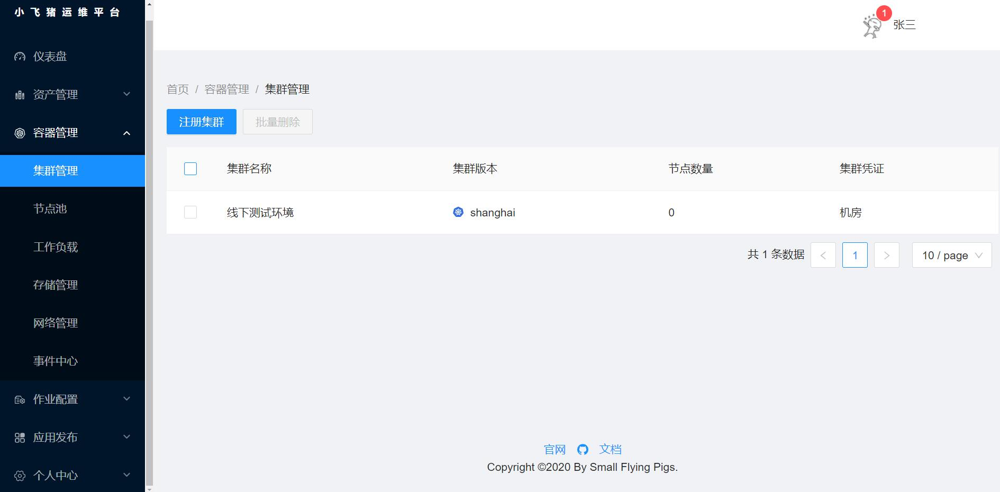

## 集群详情
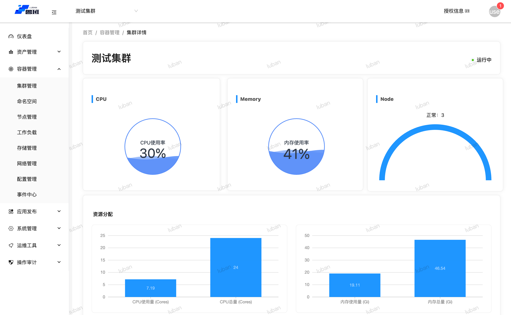

## 节点列表
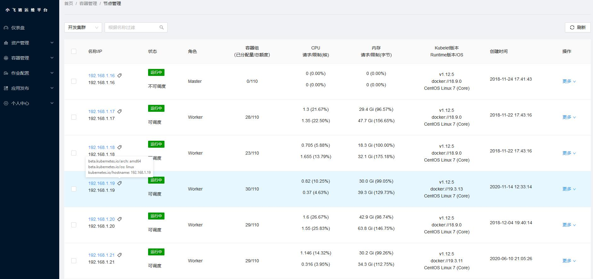


## 工作负载
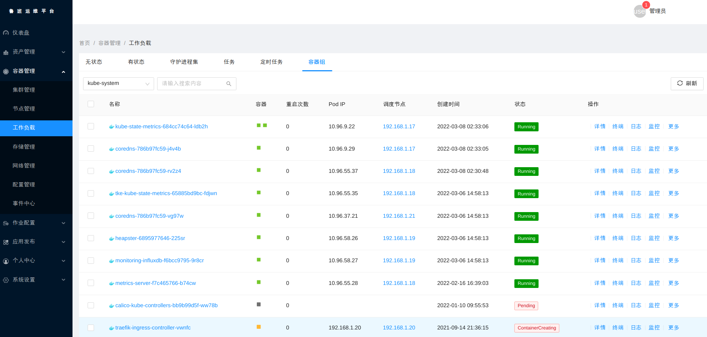


## 容器监控
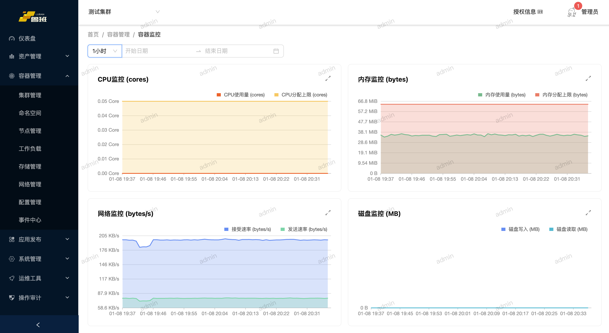


## 网络管理
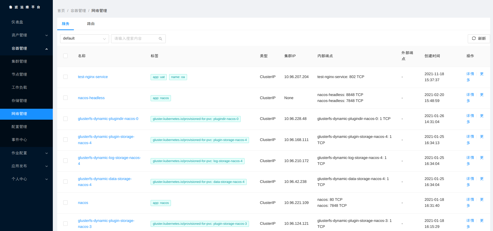

## 存储管理
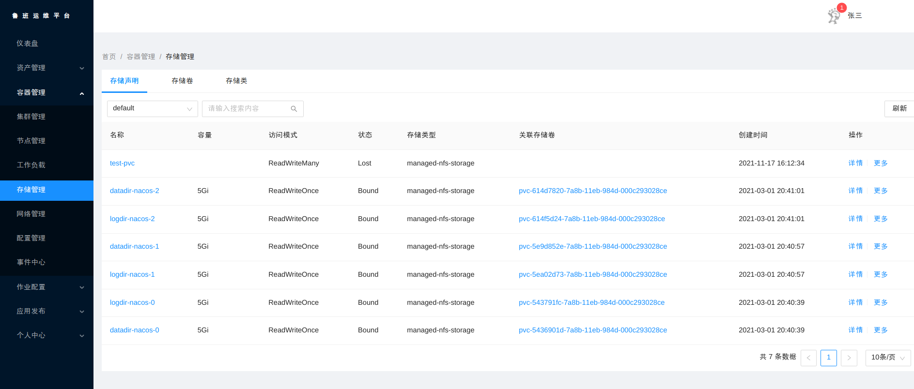

## 应用详情
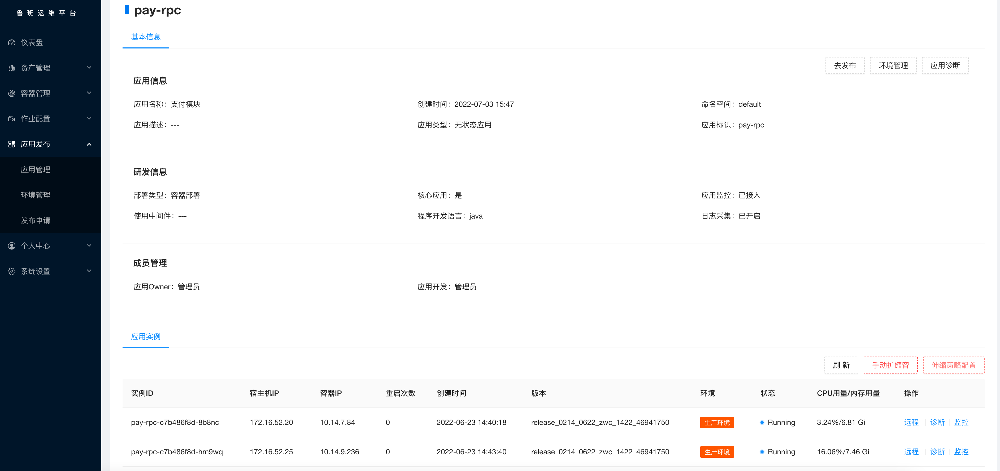

## 应用发布
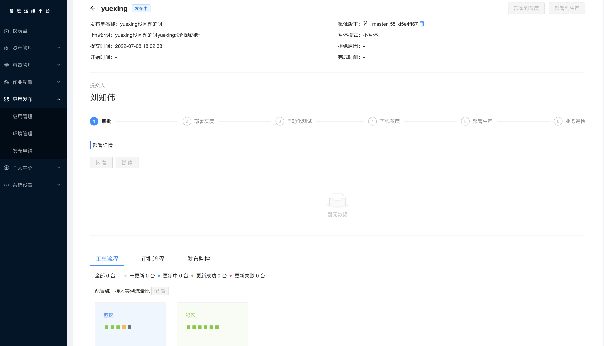


## 伸缩配置
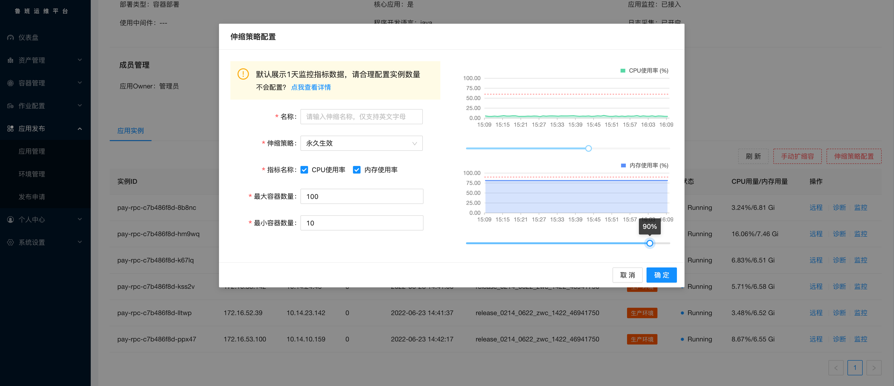

## JAVA应用诊断
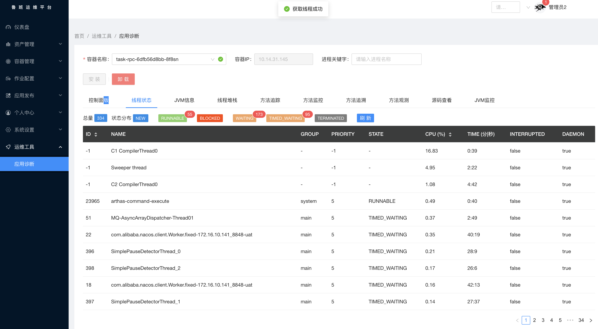


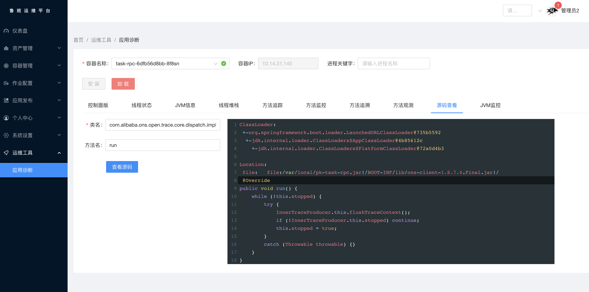

## Roadmap

> [历史版本详情](./docs/version/README.md)
> 


- 审批流


## Contributing

对于项目感兴趣，想一起贡献并完善项目请参阅[contributing](./CONTRIBUTING.md)。


## Support

* 参考[安装文档](docs/install/deploy-guide.md)
* 阅读 [源码](https://github.com/dnsjia/luban)
* 阅读 [wiki](https://github.com/dnsjia/luban/wiki) 或者寻求帮助
* 直接反馈[issue](https://github.com/dnsjia/luban/issues) ，我们会定期查看与答复
* 有兴趣的同学可以加入我们的QQ交流群，代码会持续更新，谢谢大家的支持。 QQ群: 258130203
* 同时也欢迎大家加入Kubernetes进阶交流群：548246072
* Golang新手交流群：44739364 

## FAQ

* [鲁班运维平台FAQ](https://github.com/dnsjia/luban/wiki)
* [文档中心](https://docs.dnsjia.com/)


## Star History

[](https://star-history.com/#dnsjia/luban&Date)


## License
Everything is Apache License 2.0.

