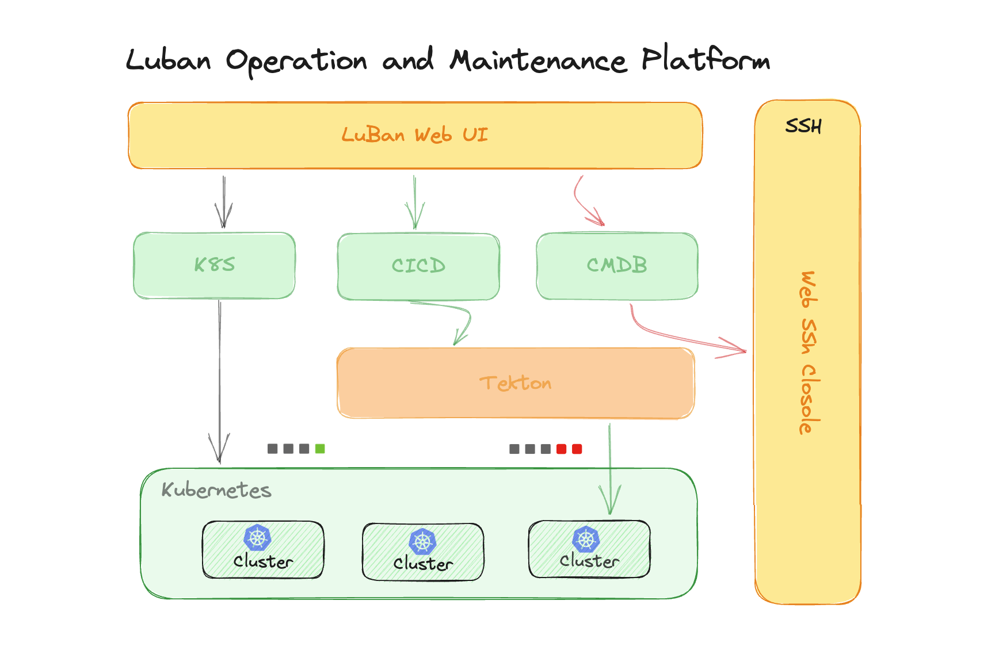
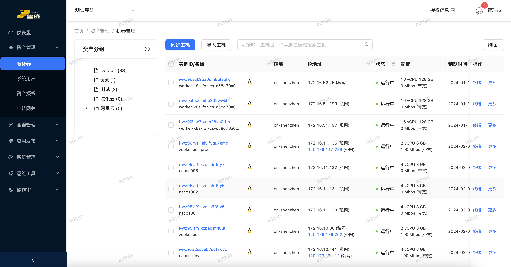
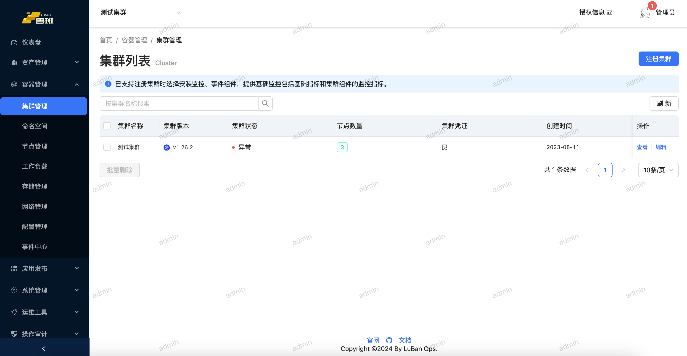
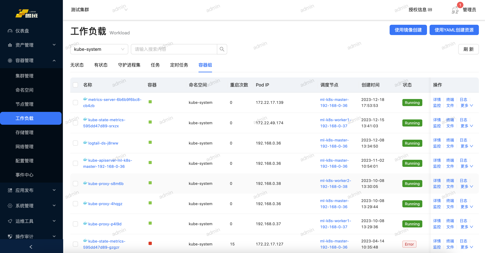
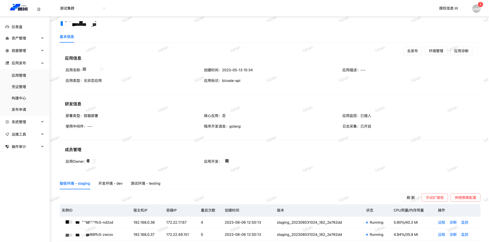
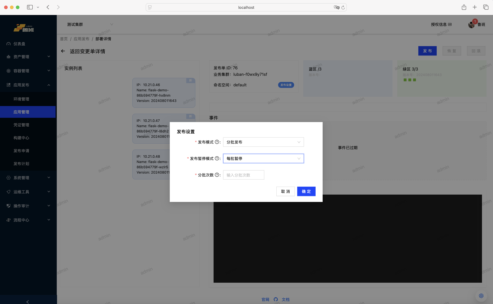
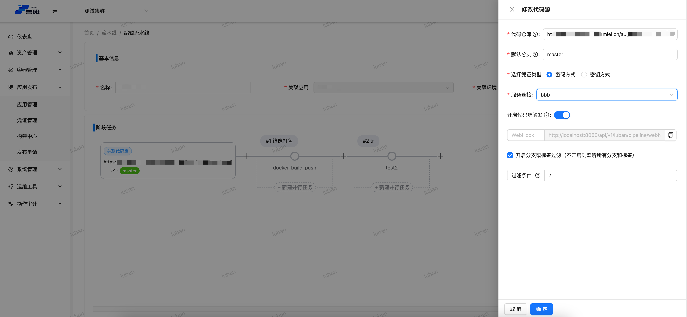

## 项目简介

<p align="center">
  <a href="https://golang.google.cn/">
    
  </a>
  <a href="https://gin-gonic.com/">
    
  </a>
  <a href="https://gorm.io/">
    
  </a>
  <a href="https://redis.io/">
    
  </a>
  <a href="https://vuejs.org/">
    
  </a>
  <a href="https://antdv.com/docs/vue/introduce-cn/">
    
  </a>
</p>

> LuBan 鲁班运维平台2.0， 本项目使用Go1.18.x、 Gin、Gorm开发， 前端使用的是Vue3+Ant Design4.x框架。




## 使用说明
1. docker-compose 快速启动
```shell script
# 拉取代码
cd luban
docker-compose up -d
```

2. 启动服务前先修改etc/config.yaml

3. 导入初始化sql, 并逐步升级到最新版本
```shell
全量更新SQL: https://docs.dnsjia.com/upgrade/sql/v2.4.0.sql
升级文档: https://docs.dnsjia.com/upgrade/changelog/
```

4. 初始账号: admin  密码: luban123.

#### 目前已经实现的功能
* 用户登录
  * LDAP/Email
* 权限管理
* 用户注册登录
  * [如何配置LDAP](.)
  * [配置钉钉扫码](.)
- K8S多集群管理
  * [集群管理](.)
  * [节点管理](.)
  * [工作负载](.)
  * [存储管理](.)
  * [网络管理](.)
  * [配置管理](.)
  * [事件中心](.)

- 资产管理
  * [远程连接](.)
  * [屏幕录像](.)
  * [文件管理](.)
  * [中转网关](.)
  * [资产授权](.)
  
- 应用发布
  * [流水线结合Tekton](.)
  * [应用发布暂停/恢复](.)

- 运维工具
  * [端口转发](.)
  
- 操作审计
  * [WebSSH屏幕录像](.)
  * [Pod登录审计](.)

## 首页


## 资产管理


## 文件管理


## 远程连接


## 集群管理


## 集群详情


## 节点列表


## 工作负载



## 容器监控


## 网络管理


## 存储管理


## 应用详情


## 应用发布


## 流水线


## 构建历史


## 伸缩配置


## JAVA应用诊断


## Roadmap

> [历史版本详情](./docs/version/README.md)
> 


- 审批流


## Contributing

对于项目感兴趣，想一起贡献并完善项目请参阅[contributing](./CONTRIBUTING.md)。


## Support

* 参考[安装文档](https://docs.dnsjia.com/getting-started/installation/)
* 阅读 [wiki](https://github.com/dnsjia/luban/wiki) 或者寻求帮助
* 直接反馈[issue](https://github.com/dnsjia/luban/issues) ，我们会定期查看与答复
* 有兴趣的同学可以加入我们的QQ群: 258130203
* 同时也欢迎大家加入Kubernetes进阶交流群：548246072


## FAQ

* [鲁班运维平台FAQ](https://github.com/dnsjia/luban/wiki)
* [文档中心](https://docs.dnsjia.com/)


## Star History

[](https://star-history.com/#dnsjia/luban&Date)


## License
Everything is Apache License 2.0.

